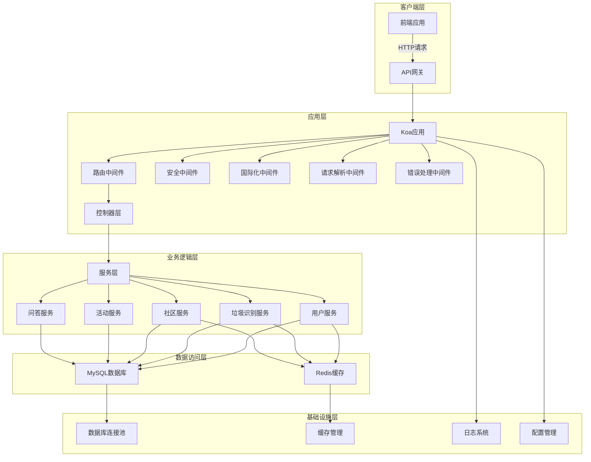
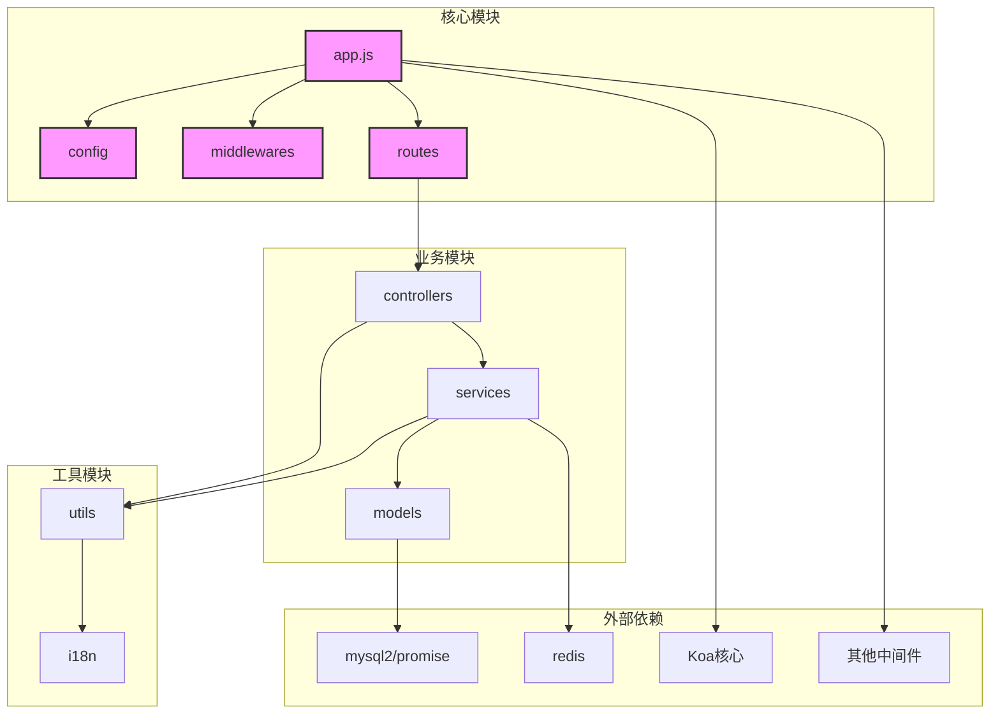
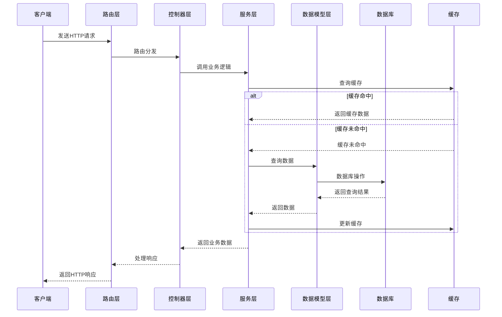

# DESIGN - 后端Koa实现

## 一、整体架构图



## 二、分层设计与核心组件说明

### 1. 应用层
- **Koa应用**: 整个后端服务的入口，负责中间件的注册和启动
- **中间件**: 
  - 路由中间件: 处理URL路由分发
  - 安全中间件: 提供安全防护功能
  - 国际化中间件: 支持多语言切换
  - 请求解析中间件: 解析HTTP请求体
  - 错误处理中间件: 统一处理异常

### 2. 控制器层
- **用户控制器**: 处理用户相关的API请求
- **垃圾识别控制器**: 处理垃圾识别相关的API请求
- **社区控制器**: 处理社区帖子相关的API请求
- **活动控制器**: 处理环保活动相关的API请求
- **问答控制器**: 处理问答相关的API请求

### 3. 业务逻辑层
- **用户服务**: 实现用户管理的核心业务逻辑
- **垃圾识别服务**: 实现垃圾识别的核心业务逻辑
- **社区服务**: 实现社区互动的核心业务逻辑
- **活动服务**: 实现活动管理的核心业务逻辑
- **问答服务**: 实现问答功能的核心业务逻辑

### 4. 数据访问层
- **MySQL数据库**: 存储系统的持久化数据
- **Redis缓存**: 缓存热点数据，提高系统性能

### 5. 基础设施层
- **数据库连接池**: 管理数据库连接，提高并发性能
- **缓存管理**: 管理Redis缓存，包括缓存策略和失效机制
- **日志系统**: 记录系统运行日志，便于监控和调试
- **配置管理**: 管理系统配置，支持多环境配置

## 三、模块依赖关系图



## 四、接口契约定义

### 1. 用户相关接口

#### 1.1 用户注册
- **URL**: POST /api/users/register
- **请求体**: 
  ```json
  {
    "phone": "string",
    "password": "string",
    "name": "string",
    "city": "string"
  }
  ```
- **响应**: 
  ```json
  {
    "code": 200,
    "message": "注册成功",
    "data": {
      "id": "string",
      "phone": "string",
      "name": "string",
      "city": "string"
    }
  }
  ```

#### 1.2 用户登录
- **URL**: POST /api/users/login
- **请求体**: 
  ```json
  {
    "phone": "string",
    "password": "string"
  }
  ```
- **响应**: 
  ```json
  {
    "code": 200,
    "message": "登录成功",
    "data": {
      "id": "string",
      "phone": "string",
      "name": "string",
      "avatar": "string",
      "token": "string"
    }
  }
  ```

### 2. 垃圾识别相关接口

#### 2.1 垃圾识别
- **URL**: POST /api/recognition
- **请求体**: 
  ```json
  {
    "image": "base64编码的图片数据",
    "city": "string"
  }
  ```
- **响应**: 
  ```json
  {
    "code": 200,
    "message": "识别成功",
    "data": {
      "id": "string",
      "wasteItemId": "number",
      "category": "string",
      "name": "string",
      "description": "string",
      "suggestion": "string",
      "confidence": "number"
    }
  }
  ```

#### 2.2 获取识别历史
- **URL**: GET /api/recognition/history
- **请求参数**: 
  - page: number, default: 1
  - limit: number, default: 10
- **响应**: 
  ```json
  {
    "code": 200,
    "message": "获取成功",
    "data": {
      "records": [
        {
          "id": "string",
          "wasteItem": {
            "id": "number",
            "name": "string",
            "category": "string"
          },
          "confidence": "number",
          "recognizedAt": "datetime"
        }
      ],
      "total": "number",
      "page": "number",
      "limit": "number"
    }
  }
  ```

### 3. 社区相关接口

#### 3.1 创建帖子
- **URL**: POST /api/posts
- **请求体**: 
  ```json
  {
    "title": "string",
    "content": "string",
    "category": "string"
  }
  ```
- **响应**: 
  ```json
  {
    "code": 200,
    "message": "创建成功",
    "data": {
      "id": "string",
      "title": "string",
      "content": "string",
      "category": "string",
      "createdAt": "datetime"
    }
  }
  ```

## 五、数据流向图



## 六、异常处理策略

### 1. 错误分类
- **系统错误**: 服务器内部错误，如数据库连接失败
- **业务错误**: 业务逻辑错误，如用户不存在
- **参数错误**: 请求参数不符合要求
- **权限错误**: 用户没有权限执行操作

### 2. 错误处理流程
1. 全局错误中间件捕获所有异常
2. 根据错误类型生成对应的错误码和错误消息
3. 记录错误日志，包括错误类型、错误信息、请求上下文等
4. 返回统一格式的错误响应

### 3. 高并发场景下的异常处理
- **数据库连接池满**: 实现连接超时处理和重试机制
- **请求过载**: 实现请求限流，拒绝超过阈值的请求
- **缓存失效**: 实现缓存预热和降级策略
- **服务降级**: 在系统负载过高时，关闭部分非核心功能

### 4. 安全异常处理
- **敏感信息保护**: 错误消息中不包含敏感信息
- **攻击检测**: 检测并记录可能的攻击行为
- **响应限制**: 限制错误响应的频率和内容

## 七、设计原则

1. **模块化设计**: 按照功能模块划分代码，提高代码的可维护性
2. **单一职责**: 每个模块和函数只负责一项功能
3. **依赖注入**: 采用依赖注入模式，降低模块间的耦合度
4. **接口分离**: 定义清晰的接口，便于测试和替换实现
5. **异常处理**: 统一的异常处理机制，提高系统的稳定性
6. **性能优化**: 关注系统性能，合理使用缓存和异步处理
7. **安全性**: 从设计阶段就考虑安全因素，避免安全漏洞
8. **可扩展性**: 设计应具备良好的扩展性，便于后续功能扩展