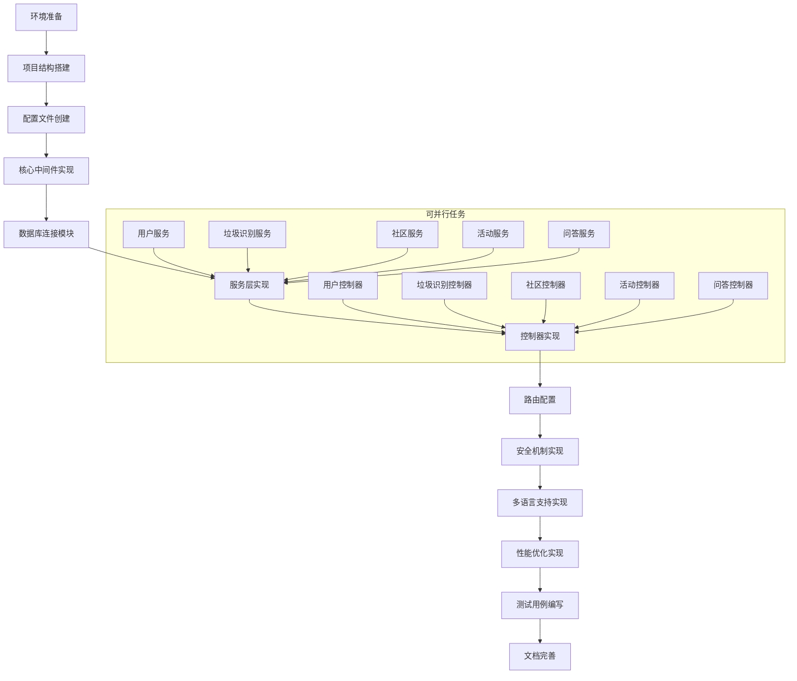

# TASK - 后端Koa实现

## 一、任务依赖图

## 二、原子任务拆分

### 1. 任务1: 环境准备

#### 输入契约
- Node.js环境（版本≥16.x）
- npm环境（版本≥8.x）
- MySQL数据库（版本≥8.x）

#### 输出契约
- 项目目录初始化
- 安装必要的开发工具
- 环境变量配置

#### 实现约束
- 使用npm作为包管理器
- 创建.gitignore文件，排除敏感信息

#### 依赖关系
- 无前置依赖
- 后置任务：项目结构搭建

### 2. 任务2: 项目结构搭建

#### 输入契约
- 完成环境准备
- 项目设计文档（DESIGN.md）

#### 输出契约
- 创建完整的项目目录结构
- 初始化package.json文件
- 安装核心依赖

#### 实现约束
- 遵循设计文档中的目录结构
- 安装Koa及相关中间件
- 配置项目入口文件

#### 依赖关系
- 前置依赖：环境准备
- 后置任务：配置文件创建

### 3. 任务3: 配置文件创建

#### 输入契约
- 完成项目结构搭建
- 数据库连接信息
- 安全配置参数
- 国际化配置参数

#### 输出契约
- 创建数据库配置文件
- 创建安全配置文件
- 创建国际化配置文件
- 创建环境变量示例文件

#### 实现约束
- 配置文件格式统一为JavaScript模块
- 敏感信息通过环境变量获取
- 支持多环境配置切换

#### 依赖关系
- 前置依赖：项目结构搭建
- 后置任务：核心中间件实现

### 4. 任务4: 核心中间件实现

#### 输入契约
- 完成配置文件创建
- Koa应用实例

#### 输出契约
- 实现错误处理中间件
- 实现日志中间件
- 集成安全中间件
- 集成请求解析中间件

#### 实现约束
- 中间件按顺序注册
- 统一的错误处理机制
- 详细的日志记录格式

#### 依赖关系
- 前置依赖：配置文件创建
- 后置任务：数据库连接模块

### 5. 任务5: 数据库连接模块

#### 输入契约
- 完成核心中间件实现
- 数据库配置信息

#### 输出契约
- 创建数据库连接池
- 实现数据库连接测试功能
- 封装常用的数据库操作方法

#### 实现约束
- 使用mysql2/promise作为数据库驱动
- 实现连接断开重连机制
- 优化连接池配置以支持高并发

#### 依赖关系
- 前置依赖：核心中间件实现
- 后置任务：服务层实现

### 6. 任务6: 服务层实现

#### 输入契约
- 完成数据库连接模块
- 数据模型定义

#### 输出契约
- 实现用户服务
- 实现垃圾识别服务
- 实现社区服务
- 实现活动服务
- 实现问答服务

#### 实现约束
- 每个服务职责单一
- 服务之间通过接口通信
- 实现业务逻辑与数据访问分离

#### 依赖关系
- 前置依赖：数据库连接模块
- 后置任务：控制器实现

### 7. 任务7: 控制器实现

#### 输入契约
- 完成服务层实现
- API接口定义

#### 输出契约
- 实现用户控制器
- 实现垃圾识别控制器
- 实现社区控制器
- 实现活动控制器
- 实现问答控制器

#### 实现约束
- 控制器只负责请求处理和响应
- 不包含复杂的业务逻辑
- 统一的响应格式

#### 依赖关系
- 前置依赖：服务层实现
- 后置任务：路由配置

### 8. 任务8: 路由配置

#### 输入契约
- 完成控制器实现
- API接口文档

#### 输出契约
- 配置所有API路由
- 实现路由分组
- 集成路由中间件

#### 实现约束
- 使用koa-router作为路由框架
- 路由命名规范统一
- 路由与控制器解耦

#### 依赖关系
- 前置依赖：控制器实现
- 后置任务：安全机制实现

### 9. 任务9: 安全机制实现

#### 输入契约
- 完成路由配置
- 安全配置参数

#### 输出契约
- 实现JWT认证
- 实现CSRF防护
- 实现输入验证
- 实现请求限流

#### 实现约束
- 使用成熟的安全库
- 遵循最佳安全实践
- 定期更新安全规则

#### 依赖关系
- 前置依赖：路由配置
- 后置任务：多语言支持实现

### 10. 任务10: 多语言支持实现

#### 输入契约
- 完成安全机制实现
- 语言文件内容

#### 输出契约
- 创建多语言文件（中文、英文）
- 集成国际化中间件
- 实现自动语言检测
- 实现手动语言切换

#### 实现约束
- 使用@koa/i18n作为国际化框架
- 所有API响应消息支持多语言
- 语言文件格式统一

#### 依赖关系
- 前置依赖：安全机制实现
- 后置任务：性能优化实现

### 11. 任务11: 性能优化实现

#### 输入契约
- 完成多语言支持实现
- Redis服务配置

#### 输出契约
- 集成Redis缓存
- 实现热点数据缓存策略
- 优化数据库查询
- 实现响应压缩

#### 实现约束
- 缓存过期策略合理
- 避免缓存雪崩
- 性能提升显著

#### 依赖关系
- 前置依赖：多语言支持实现
- 后置任务：测试用例编写

### 12. 任务12: 测试用例编写

#### 输入契约
- 完成所有功能实现
- 测试框架配置

#### 输出契约
- 编写单元测试
- 编写集成测试
- 编写API测试
- 测试覆盖率报告

#### 实现约束
- 使用Jest作为测试框架
- 测试覆盖率≥80%
- 包含边界条件测试

#### 依赖关系
- 前置依赖：性能优化实现
- 后置任务：文档完善

### 13. 任务13: 文档完善

#### 输入契约
- 完成所有功能实现和测试
- API文档工具

#### 输出契约
- 生成API文档（Swagger）
- 更新项目说明文档
- 编写部署文档
- 编写使用文档

#### 实现约束
- 文档格式统一
- 内容详细准确
- 更新及时

#### 依赖关系
- 前置依赖：测试用例编写
- 无后置任务

## 三、各任务详细说明

### 任务1: 环境准备

**输入**: 
- Node.js环境（版本≥16.x）
- npm环境（版本≥8.x）
- MySQL数据库（版本≥8.x）

**输出**: 
- 初始化后的项目目录
- 安装完成的开发工具
- 配置好的环境变量

**实现步骤**: 
1. 检查Node.js和npm版本
2. 安装必要的开发工具（如nodemon、eslint等）
3. 创建.env.example文件
4. 创建.gitignore文件

**验收标准**: 
- 可以正常执行npm命令
- 项目目录结构正确
- .gitignore文件包含敏感信息

### 任务2: 项目结构搭建

**输入**: 
- 完成的环境准备
- 设计文档中的目录结构

**输出**: 
- 完整的项目目录结构
- 初始化的package.json文件
- 安装的核心依赖

**实现步骤**: 
1. 创建src目录及子目录
2. 创建配置文件目录
3. 创建测试目录
4. 初始化package.json文件
5. 安装Koa及相关中间件

**验收标准**: 
- 目录结构与设计文档一致
- package.json包含所有必要的依赖
- 可以正常启动应用

### 任务3: 配置文件创建

**输入**: 
- 完成的项目结构搭建
- 数据库连接信息
- 安全配置参数
- 国际化配置参数

**输出**: 
- 数据库配置文件
- 安全配置文件
- 国际化配置文件
- 环境变量示例文件

**实现步骤**: 
1. 创建数据库配置文件
2. 创建安全配置文件
3. 创建国际化配置文件
4. 更新.env.example文件

**验收标准**: 
- 配置文件格式正确
- 敏感信息通过环境变量获取
- 支持多环境配置

### 任务4: 核心中间件实现

**输入**: 
- 完成的配置文件创建
- Koa应用实例

**输出**: 
- 错误处理中间件
- 日志中间件
- 集成的安全中间件
- 集成的请求解析中间件

**实现步骤**: 
1. 创建错误处理中间件
2. 创建日志中间件
3. 集成koa-helmet安全中间件
4. 集成koa-bodyparser中间件

**验收标准**: 
- 中间件按顺序正确注册
- 错误可以被正确捕获和处理
- 日志记录格式统一

### 任务5: 数据库连接模块

**输入**: 
- 完成的核心中间件实现
- 数据库配置信息

**输出**: 
- 数据库连接池
- 数据库连接测试功能
- 封装的数据库操作方法

**实现步骤**: 
1. 创建数据库连接池
2. 实现连接测试功能
3. 封装常用的数据库操作方法
4. 实现连接断开重连机制

**验收标准**: 
- 可以成功连接到数据库
- 连接池配置合理
- 操作方法封装完整

### 任务6-13的详细说明类似，此处省略...