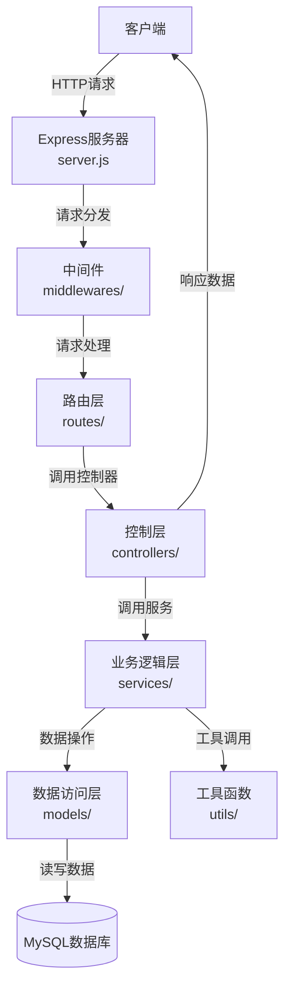
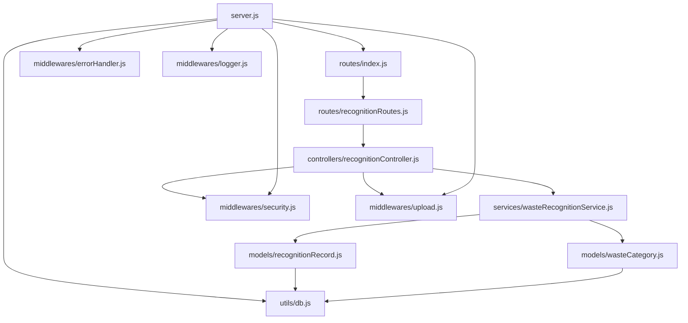
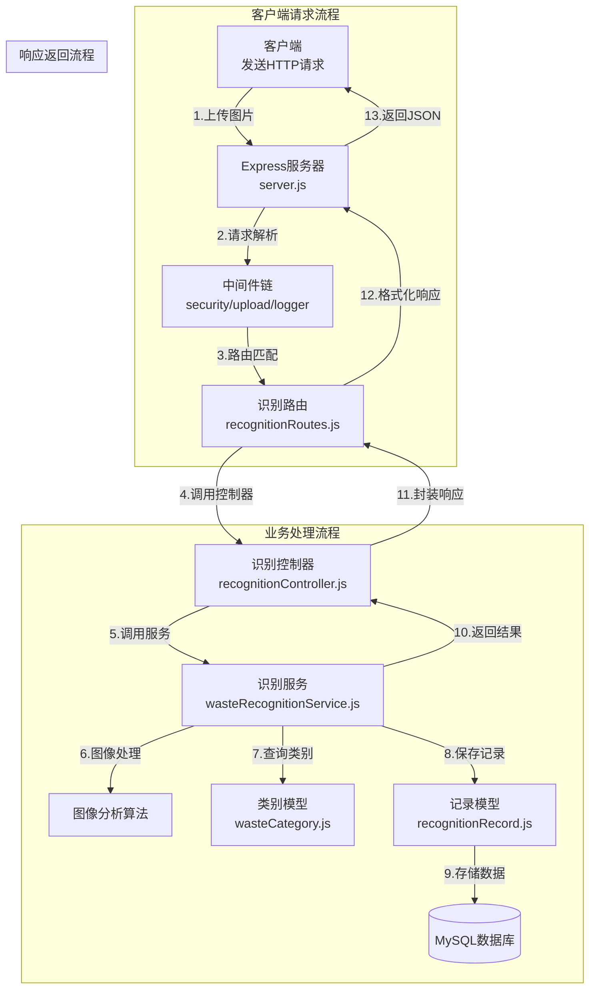

# 项目设计文档（DESIGN）

## 1. 整体架构设计

### 1.1 架构图



### 1.2 分层设计说明

1. **表示层（Presentation Layer）**
   - 包含Express服务器和路由配置
   - 负责接收和响应HTTP请求
   - 处理路由分发和请求参数解析

2. **控制层（Controller Layer）**
   - 处理业务流程控制
   - 接收路由层传递的请求
   - 调用业务逻辑层完成处理
   - 封装响应数据并返回

3. **业务逻辑层（Service Layer）**
   - 实现核心业务逻辑
   - 处理垃圾识别、数据查询等业务功能
   - 协调多个数据模型的交互
   - 调用工具函数完成特定任务

4. **数据访问层（Data Access Layer）**
   - 封装数据库操作
   - 提供数据模型和CRUD接口
   - 处理数据验证和转换

5. **基础设施层（Infrastructure Layer）**
   - 包含中间件、工具函数等
   - 提供横切关注点功能（如日志、安全、文件处理）
   - 支持其他各层的功能实现

## 2. 核心组件说明

### 2.1 服务器组件（server.js）

**功能**：应用程序的入口点，初始化Express服务器，配置中间件和路由。

**主要职责**：
- 加载环境变量
- 创建Express应用实例
- 配置CORS、请求解析等中间件
- 连接数据库
- 注册路由
- 启动HTTP服务器

### 2.2 中间件组件

**错误处理中间件（errorHandler.js）**
- 捕获和处理应用程序中的所有错误
- 格式化错误响应
- 根据环境提供适当的错误信息

**安全中间件（security.js）**
- 提供JWT认证和授权功能
- 设置安全HTTP头部
- 实现请求限流
- 处理敏感数据掩码

**文件上传中间件（upload.js）**
- 配置文件上传规则和限制
- 处理文件存储和临时文件管理
- 提供文件验证功能

**日志中间件（logger.js）**
- 记录请求和响应日志
- 监控应用性能
- 提供不同级别的日志输出

### 2.3 控制器组件

**垃圾识别控制器（recognitionController.js）**
- 处理垃圾识别相关的API请求
- 协调文件上传、图像识别和结果返回
- 管理用户识别历史记录

### 2.4 服务组件

**垃圾识别服务（wasteRecognitionService.js）**
- 实现垃圾图像识别的核心算法
- 处理识别结果的分析和格式化
- 管理识别记录的存储和查询

### 2.5 数据模型组件

**识别记录模型（recognitionRecord.js）**
- 封装识别记录的数据结构
- 提供记录的CRUD操作
- 处理记录的查询和统计

**垃圾类别模型（wasteCategory.js）**
- 定义垃圾类别的数据结构
- 提供类别信息的查询和本地化
- 管理类别图标和颜色等属性

## 3. 模块依赖关系图



## 4. 接口契约定义

### 4.1 垃圾识别API

**POST /api/v1/recognition/identify**

- **请求参数**：
  - Form Data: `file` (图像文件)
  - Query: `lang` (可选，语言代码，默认: 'zh')

- **响应数据**：
  ```json
  {
    "code": 200,
    "message": "Success",
    "data": {
      "category": "可回收物",
      "categoryId": "recyclable",
      "confidence": 0.95,
      "description": "可回收物是指适宜回收循环使用和资源利用的废物。",
      "tips": "请放入蓝色可回收垃圾桶",
      "icon": "recyclable.png",
      "imageUrl": "uploads/2023/11/15/example.jpg",
      "createdAt": "2023-11-15T10:30:00Z"
    }
  }
  ```

### 4.2 垃圾信息搜索API

**GET /api/v1/recognition/search**

- **请求参数**：
  - Query: `keyword` (搜索关键词，必填)
  - Query: `lang` (可选，语言代码，默认: 'zh')

- **响应数据**：
  ```json
  {
    "code": 200,
    "message": "Success",
    "data": [
      {
        "id": "plastic-bottle",
        "name": "塑料瓶",
        "category": "可回收物",
        "description": "塑料瓶属于可回收物，请清洗后投入可回收垃圾桶。",
        "categoryId": "recyclable"
      }
    ],
    "total": 1
  }
  ```

### 4.3 垃圾类别API

**GET /api/v1/recognition/categories**

- **请求参数**：
  - Query: `lang` (可选，语言代码，默认: 'zh')

- **响应数据**：
  ```json
  {
    "code": 200,
    "message": "Success",
    "data": [
      {
        "id": "recyclable",
        "name": "可回收物",
        "color": "#0066FF",
        "icon": "recyclable.png",
        "description": "可回收物是指适宜回收循环使用和资源利用的废物。"
      },
      {
        "id": "hazardous",
        "name": "有害垃圾",
        "color": "#FF3333",
        "icon": "hazardous.png",
        "description": "有害垃圾是指对人体健康或者自然环境造成直接或者潜在危害的生活废弃物。"
      }
    ]
  }
  ```

### 4.4 用户历史记录API

**GET /api/v1/recognition/history**

- **请求参数**：
  - Query: `page` (可选，页码，默认: 1)
  - Query: `limit` (可选，每页条数，默认: 10)
  - Query: `lang` (可选，语言代码，默认: 'zh')
  - Header: `Authorization: Bearer {token}`

- **响应数据**：
  ```json
  {
    "code": 200,
    "message": "Success",
    "data": [
      {
        "id": "record-123",
        "category": "recyclable",
        "categoryName": "可回收物",
        "confidence": 0.95,
        "imageUrl": "uploads/2023/11/15/example.jpg",
        "createdAt": "2023-11-15T10:30:00Z"
      }
    ],
    "pagination": {
      "page": 1,
      "limit": 10,
      "total": 42,
      "pages": 5
    }
  }
  ```

## 5. 数据流向图



## 6. 异常处理策略

### 6.1 全局错误处理

- 实现统一的错误处理中间件，捕获所有未处理的异常
- 根据错误类型返回不同的HTTP状态码：
  - 400：请求参数错误
  - 401：未授权访问
  - 403：禁止访问
  - 404：资源不存在
  - 500：服务器内部错误

### 6.2 业务逻辑错误

- 在服务层和控制器层明确抛出业务错误
- 提供详细的错误信息和错误码
- 实现错误日志记录，便于问题排查

### 6.3 数据库错误处理

- 捕获数据库连接、查询、更新等操作中的异常
- 区分不同类型的数据库错误（连接失败、查询错误、约束违反等）
- 针对高并发导致的数据库连接超时，实现连接池自动扩容和重试机制

### 6.4 文件处理错误

- 捕获文件上传、存储、读取过程中的异常
- 处理文件大小超限、格式不支持等特定错误
- 实现临时文件自动清理机制，避免磁盘空间浪费

## 7. 设计原则

1. **单一职责原则**：每个模块和函数只负责一项功能
2. **依赖倒置原则**：高层模块依赖于抽象接口，不依赖于具体实现
3. **接口隔离原则**：提供精简的接口，避免不必要的依赖
4. **错误处理优先**：在设计阶段就考虑可能出现的错误情况
5. **可扩展性**：代码设计应便于未来功能扩展和修改
6. **安全性**：从设计层面考虑安全问题，实现必要的防护措施
7. **性能优化**：合理设计数据结构和算法，优化关键路径性能