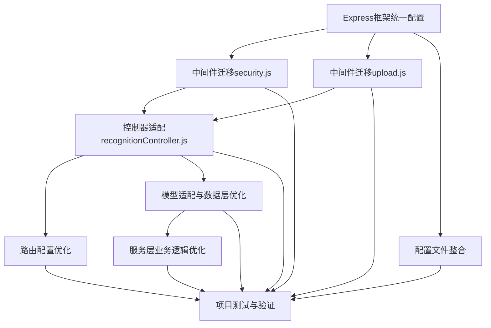

# 项目任务文档（TASK）

## 1. 任务拆分概述

基于架构设计文档，将项目重构和优化工作拆分为以下原子任务：

| 任务ID | 任务名称 | 实现时长 | 依赖关系 |
|--------|---------|---------|---------|
| T001 | Express框架统一配置 | 2小时 | 无 |
| T002 | 中间件迁移（security.js） | 3小时 | T001 |
| T003 | 中间件迁移（upload.js） | 2小时 | T001 |
| T004 | 控制器适配（recognitionController.js） | 3小时 | T002, T003 |
| T005 | 路由配置优化 | 1小时 | T004 |
| T006 | 配置文件整合 | 2小时 | T001 |
| T007 | 模型适配与数据层优化 | 2小时 | T004 |
| T008 | 服务层业务逻辑优化 | 3小时 | T007 |
| T009 | 项目测试与验证 | 4小时 | T002-T008 |

## 2. 原子任务详细定义

### T001: Express框架统一配置

**输入契约**：
- 现有server.js文件
- 现有package.json文件

**输出契约**：
- 统一使用Express框架的配置文件
- 移除未使用的Koa相关依赖
- 确保Express服务器配置完整

**实现约束**：
- 保持项目原有端口和基础配置
- 确保环境变量加载机制正常
- 遵循现有代码风格和命名规范

**依赖关系**：
- 无前置依赖
- 后续任务T002-T006依赖此任务

### T002: 中间件迁移（security.js）

**输入契约**：
- 现有src/middlewares/security.js文件
- Express框架统一配置（来自T001）

**输出契约**：
- Express风格的security.js中间件
- 支持JWT认证和角色授权
- 实现安全头部设置和请求限流
- 提供敏感数据掩码功能

**实现约束**：
- 保持原有功能不变
- 使用Express的req/res对象替代Koa的ctx对象
- 确保错误处理方式符合Express规范

**依赖关系**：
- 前置任务：T001
- 后续任务：T004

### T003: 中间件迁移（upload.js）

**输入契约**：
- 现有src/middlewares/upload.js文件
- Express框架统一配置（来自T001）

**输出契约**：
- Express风格的upload.js中间件
- 基于multer的文件上传处理
- 支持文件验证和错误处理

**实现约束**：
- 使用multer替代@koa/multer
- 保持文件上传配置和限制不变
- 确保与recognitionController.js兼容

**依赖关系**：
- 前置任务：T001
- 后续任务：T004

### T004: 控制器适配（recognitionController.js）

**输入契约**：
- 现有src/controllers/recognitionController.js文件
- Express风格的security.js中间件（来自T002）
- Express风格的upload.js中间件（来自T003）

**输出契约**：
- Express风格的recognitionController.js
- 适配Express的请求/响应模型
- 确保所有API端点功能正常

**实现约束**：
- 使用req/res对象替代ctx对象
- 保持原有业务逻辑不变
- 错误处理方式符合Express规范

**依赖关系**：
- 前置任务：T002, T003
- 后续任务：T005, T007, T008

### T005: 路由配置优化

**输入契约**：
- 现有src/routes目录下的路由文件
- Express风格的控制器（来自T004）

**输出契约**：
- 统一的路由配置结构
- 正确的中间件应用
- 完整的路由文档

**实现约束**：
- 保持原有API端点路径不变
- 确保路由参数验证正常工作
- 遵循RESTful API设计原则

**依赖关系**：
- 前置任务：T004

### T006: 配置文件整合

**输入契约**：
- 现有src/config目录下的配置文件
- Express框架统一配置（来自T001）

**输出契约**：
- 整合后的配置文件
- 统一的配置加载机制
- 清晰的配置文档

**实现约束**：
- 保持原有配置项不变
- 确保环境变量正确覆盖配置
- 配置文件格式统一

**依赖关系**：
- 前置任务：T001

### T007: 模型适配与数据层优化

**输入契约**：
- 现有src/models目录下的模型文件
- Express风格的控制器（来自T004）

**输出契约**：
- 适配Express的模型文件
- 优化的数据访问接口
- 统一的错误处理机制

**实现约束**：
- 保持数据结构不变
- 确保数据库操作性能
- 实现必要的数据验证

**依赖关系**：
- 前置任务：T004
- 后续任务：T008

### T008: 服务层业务逻辑优化

**输入契约**：
- 现有src/services目录下的服务文件
- 优化后的模型文件（来自T007）

**输出契约**：
- 优化的业务逻辑实现
- 清晰的服务接口
- 完善的错误处理

**实现约束**：
- 保持原有业务功能不变
- 提高代码可读性和可维护性
- 优化关键路径性能

**依赖关系**：
- 前置任务：T007

### T009: 项目测试与验证

**输入契约**：
- 完成重构后的所有代码文件
- 项目文档

**输出契约**：
- 完整的测试报告
- 修复后的bug列表
- 验证通过的功能清单

**实现约束**：
- 测试所有API端点功能
- 验证文件上传和处理功能
- 测试用户认证和授权流程
- 检查系统性能和稳定性

**依赖关系**：
- 前置任务：T002-T008

## 3. 任务依赖图

## 4. 执行检查清单

### 4.1 完整性检查
- [ ] 所有需求是否已覆盖
- [ ] 所有代码文件是否已考虑
- [ ] 所有依赖关系是否已明确

### 4.2 一致性检查
- [ ] 是否与前期文档保持一致
- [ ] 代码风格是否统一
- [ ] API设计是否符合规范

### 4.3 可行性检查
- [ ] 技术方案是否切实可行
- [ ] 时间估算是否合理
- [ ] 资源需求是否满足

### 4.4 可控性检查
- [ ] 风险是否在可接受范围
- [ ] 复杂度是否可控
- [ ] 是否有备选方案

### 4.5 可测性检查
- [ ] 验收标准是否明确可执行
- [ ] 测试方法是否可行
- [ ] 测试工具是否准备就绪

## 5. 最终确认清单

### 5.1 明确的实现需求
- [ ] 框架统一为Express.js
- [ ] 中间件迁移完成
- [ ] 控制器适配完成
- [ ] 路由配置优化完成
- [ ] 配置文件整合完成
- [ ] 模型适配完成
- [ ] 服务层优化完成

### 5.2 明确的子任务定义
- [ ] 所有子任务已详细定义
- [ ] 输入输出契约已明确
- [ ] 实现约束已清晰

### 5.3 明确的边界和限制
- [ ] 任务范围已明确
- [ ] 功能边界已确定
- [ ] 时间限制已设定

### 5.4 明确的验收标准
- [ ] 功能完整性标准
- [ ] 代码质量标准
- [ ] 性能要求标准
- [ ] 稳定性要求标准

### 5.5 清晰的质量标准
- [ ] 代码风格标准
- [ ] 测试覆盖率标准
- [ ] 文档完整性标准