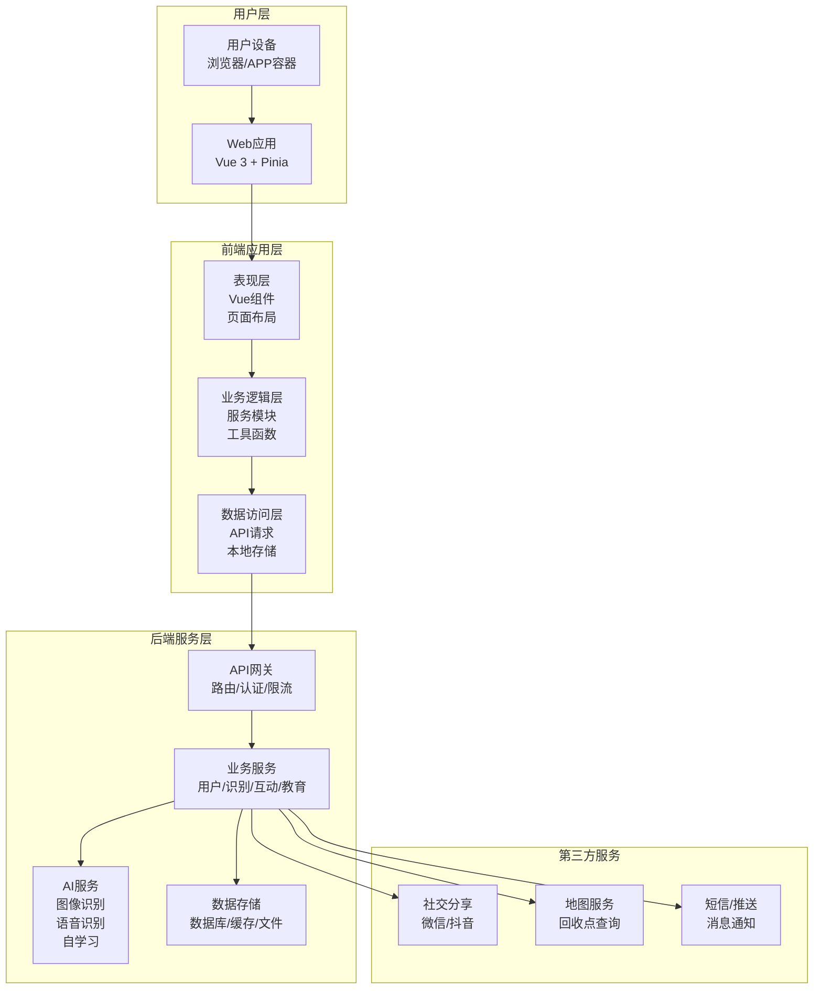
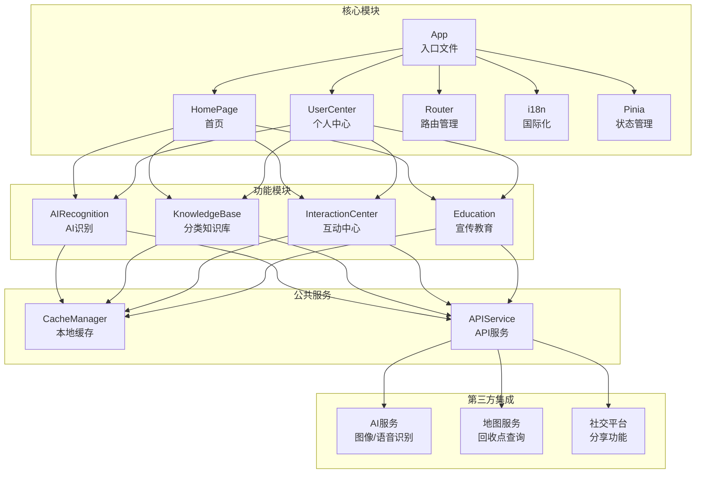
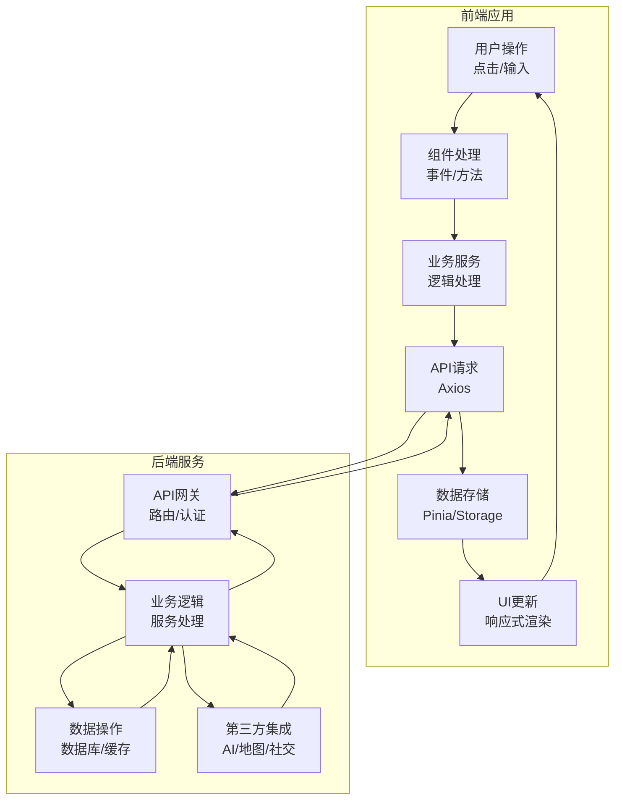

# DESIGN: 智能垃圾分类系统架构设计文档

## 一、整体架构设计

### 1. 系统架构图

### 2. 架构说明
- **前端架构**: 采用Vue 3 + Pinia的组合，基于组件化、模块化的开发模式
- **后端架构**: 微服务架构，包含用户服务、识别服务、互动服务、教育服务等
- **数据流向**: 前端请求 -> API网关 -> 业务服务 -> 数据存储/AI服务/第三方服务
- **技术特点**: 前后端分离、高内聚低耦合、可扩展性强

## 二、分层设计与核心组件

### 1. 前端分层设计

**1.1 表现层 (Presentation Layer)**
- **核心职责**: 用户界面展示、用户交互处理
- **关键组件**: 页面组件、布局组件、UI组件、路由组件
- **技术实现**: Vue 3 Composition API、Vant UI组件库

**1.2 业务逻辑层 (Business Logic Layer)**
- **核心职责**: 业务规则处理、状态管理、数据转换
- **关键组件**: 业务服务、工具函数、状态管理模块
- **技术实现**: Pinia状态管理、自定义服务类

**1.3 数据访问层 (Data Access Layer)**
- **核心职责**: 数据获取、数据存储、API通信
- **关键组件**: API请求模块、本地存储模块、Mock数据模块
- **技术实现**: Axios、IndexedDB、LocalStorage

### 2. 核心功能模块设计

**2.1 首页模块 (HomePage)**
- **功能**: 核心功能入口聚合、快捷推荐
- **组件**: Header、QuickActions、RecommendSection、SkeletonScreen
- **状态管理**: userStore(用户信息)、homeStore(推荐数据)

**2.2 AI识别模块 (AIRecognition)**
- **功能**: 图像识别、语音识别、文字识别
- **组件**: CameraView、VoiceInput、TextSearch、RecognitionResult
- **状态管理**: recognitionStore(识别历史、识别结果)
- **技术要点**: Web Camera API、Web Speech API、第三方AI服务集成

**2.3 分类知识库模块 (KnowledgeBase)**
- **功能**: 垃圾分类查询、场景化分类指南
- **组件**: CategoryTabs、GarbageList、SceneSelector、SearchBar
- **状态管理**: knowledgeStore(分类数据、场景数据)

**2.4 互动中心模块 (InteractionCenter)**
- **功能**: 积分任务、社交互动、答题闯关
- **组件**: PointsTaskList、FriendPKCard、CommunityEntry、QuizSection
- **状态管理**: interactionStore(积分、任务、成就)

**2.5 宣传教育模块 (Education)**
- **功能**: 分层教育内容、海报生成
- **组件**: EducationTabs、ContentCardList、PosterGenerator
- **状态管理**: educationStore(教育内容、海报模板)

**2.6 个人中心模块 (UserCenter)**
- **功能**: 用户数据看板、设置、反馈
- **组件**: UserProfile、DataDashboard、SettingsSection、FeedbackForm
- **状态管理**: userStore(个人信息、设置项)

### 3. 核心技术组件

**3.1 国际化组件 (i18n)**
- **功能**: 支持中文、英语、马来语三种语言切换
- **实现**: Vue I18n、翻译资源文件管理
- **文件结构**: src/locales/{zh, en, ms}.js

**3.2 骨架屏组件 (SkeletonScreen)**
- **功能**: 页面加载时显示占位符，提升用户体验
- **实现**: CSS动画、Vue指令控制
- **应用场景**: 首页、识别结果页、分类知识库页

**3.3 本地缓存组件 (CacheManager)**
- **功能**: 缓存常见垃圾特征、识别结果、用户偏好
- **实现**: IndexedDB、LocalStorage
- **策略**: LRU缓存淘汰、定期清理、数据同步机制

**3.4 性能优化组件 (PerformanceOptimizer)**
- **功能**: 图片优化、资源预加载、代码分割
- **实现**: WebP格式、动态导入、组件缓存
- **工具**: Vite内置优化、Web Vitals监控

## 三、模块依赖关系图

## 四、接口契约定义

### 1. API接口规范
- **基础URL**: /api/v1/
- **请求格式**: JSON
- **响应格式**: JSON
- **认证方式**: JWT Token (Bearer Token)
- **错误处理**: 统一错误码、错误信息

### 2. 核心API接口定义

**2.1 用户相关接口**
- **用户登录**: POST /auth/login
  - 请求: {username, password}
  - 响应: {token, userInfo}
- **获取用户信息**: GET /user/info
  - 请求: {Authorization: Bearer token}
  - 响应: {userId, username, avatar, points, achievements}
- **更新用户信息**: PUT /user/info
  - 请求: {userId, avatar, nickname, city}
  - 响应: {code, message, userInfo}

**2.2 AI识别相关接口**
- **图像识别**: POST /recognition/image
  - 请求: {imageData, userId}
  - 响应: {garbageType, category, confidence, description}
- **语音识别**: POST /recognition/voice
  - 请求: {audioData, userId}
  - 响应: {garbageType, category, confidence, description}
- **文字搜索**: GET /recognition/text?keyword={keyword}&userId={userId}
  - 响应: {garbageType, category, description}
- **获取识别历史**: GET /recognition/history?userId={userId}&page={page}&size={size}
  - 响应: {list: [{id, garbageName, category, time}], total}

**2.3 知识相关接口**
- **获取分类列表**: GET /knowledge/categories
  - 响应: {categories: [{id, name, icon}]}
- **获取垃圾列表**: GET /knowledge/garbages?categoryId={categoryId}&page={page}&size={size}
  - 响应: {list: [{id, name, image, category, description}], total}
- **获取垃圾详情**: GET /knowledge/garbage/{id}
  - 响应: {id, name, image, category, description, recyclingTips}
- **获取场景列表**: GET /knowledge/scenes
  - 响应: {scenes: [{id, name, icon}]}
- **获取场景垃圾**: GET /knowledge/scene/{id}/garbages
  - 响应: {list: [{id, name, image, category}]}

**2.4 互动相关接口**
- **获取积分任务**: GET /interaction/tasks?userId={userId}
  - 响应: {tasks: [{id, name, points, status}]}
- **领取任务奖励**: POST /interaction/task/{id}/claim
  - 请求: {userId}
  - 响应: {code, message, pointsAdded}
- **获取好友列表**: GET /interaction/friends?userId={userId}
  - 响应: {friends: [{id, name, avatar, score}]}
- **创建PK挑战**: POST /interaction/pk/create
  - 请求: {userId, friendIds}
  - 响应: {pkId, status}
- **获取答题题目**: GET /interaction/quiz/questions?type={type}&level={level}
  - 响应: {questions: [{id, content, options, correctAnswer, explanation}]}
- **提交答题结果**: POST /interaction/quiz/submit
  - 请求: {userId, questionId, userAnswer}
  - 响应: {isCorrect, explanation, pointsAdded}

## 五、数据流向与异常处理

### 1. 数据流向图

### 2. 异常处理策略

**2.1 前端异常处理**
- **网络异常**: Axios拦截器统一处理，显示网络错误提示
- **业务异常**: 捕获API返回的错误码，显示对应的错误信息
- **组件异常**: 使用Vue的errorCaptured钩子捕获组件内异常
- **全局异常**: 使用window.onerror和Vue.config.errorHandler捕获未处理的异常
- **降级策略**: 关键功能在异常情况下提供降级方案（如使用缓存数据）

**2.2 错误提示机制**
- **Toast提示**: 轻量级操作反馈（如"操作成功"、"网络错误"）
- **Dialog提示**: 重要信息或需要用户确认的操作
- **页面级错误**: 整页显示错误信息和重试按钮
- **日志记录**: 前端异常日志收集，便于问题排查

**2.3 性能监控**
- **关键指标**: 页面加载时间、首屏时间、交互响应时间
- **监控工具**: 集成Web Vitals API，收集性能数据
- **预警机制**: 设置性能阈值，超出阈值时报警

## 六、技术选型与框架特性

### 1. 前端技术栈
- **Vue 3**: 提供Composition API、Teleport、Fragments等现代特性
- **Pinia**: 轻量级状态管理，支持TypeScript，与Vue 3兼容良好
- **Vite**: 快速的构建工具，支持热模块替换
- **Vant**: 移动端UI组件库，提供丰富的组件和良好的用户体验
- **Vue I18n**: 国际化解决方案，支持多语言切换
- **Axios**: HTTP客户端，支持拦截器、取消请求等特性

### 2. 关键技术特性
- **响应式设计**: 使用CSS Grid、Flexbox实现响应式布局
- **组件懒加载**: 按需加载组件，减少首屏体积
- **图片优化**: 使用WebP格式、响应式图片、懒加载
- **骨架屏**: 提升用户感知性能
- **手势操作**: 支持滑动、捏合等移动端手势
- **PWA支持**: 支持离线使用、添加到主屏幕等特性

## 七、扩展性与可维护性设计

### 1. 扩展性设计
- **模块化架构**: 功能模块间低耦合，便于独立开发和测试
- **插件系统**: 支持通过插件扩展功能
- **主题定制**: 支持自定义主题颜色、字体等
- **国际化框架**: 便于添加新的语言支持
- **接口抽象**: 统一的数据访问接口，便于切换底层实现

### 2. 可维护性设计
- **代码规范**: 遵循Vue.js代码规范，使用ESLint、Prettier保证代码质量
- **组件文档**: 为公共组件编写文档，提供使用示例
- **TypeScript支持**: 使用TypeScript进行类型检查，减少运行时错误
- **单元测试**: 为核心功能编写单元测试，保证代码稳定性
- **版本控制**: 严格的版本控制策略，便于追踪和回滚

## 八、安全与合规性

### 1. 前端安全措施
- **XSS防护**: 输入验证、内容安全策略(CSP)
- **CSRF防护**: 使用CSRF token、SameSite Cookie
- **数据加密**: 敏感数据本地加密存储
- **API安全**: 使用HTTPS、JWT认证、请求签名
- **权限控制**: 前端路由守卫，控制页面访问权限

### 2. 合规性要求
- **隐私保护**: 遵循GDPR、CCPA等隐私法规
- **数据存储**: 符合数据保护要求，定期清理过期数据
- **用户协议**: 明确的用户协议和隐私政策
- **可访问性**: 支持键盘导航、屏幕阅读器等辅助功能