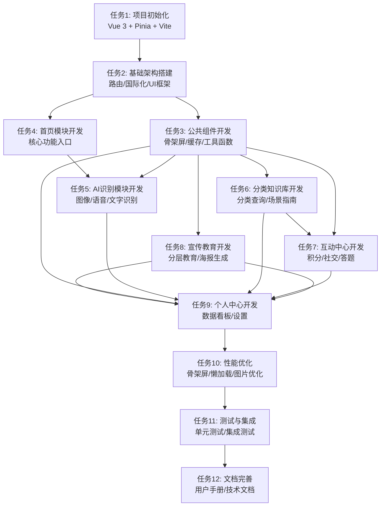

# TASK: 智能垃圾分类系统原子任务拆分文档

## 一、任务拆分原则
1. **原子性**: 每个任务独立可交付，实现时长≤4小时
2. **完整性**: 覆盖所有需求功能点
3. **依赖性**: 明确任务间依赖关系，无循环依赖
4. **可测性**: 每个任务有明确的验收标准

## 二、任务依赖图

## 三、原子任务详情

### 任务1: 项目初始化 (Vue 3 + Pinia + Vite)
- **目标**: 搭建项目基础框架，配置开发环境
- **输入契约**: 
  - Node.js 环境 (v16+)
  - npm/yarn/pnpm 包管理器
- **输出契约**: 
  - 初始化的Vue 3项目目录结构
  - 基础依赖安装完成
  - 项目能正常启动和构建
- **实现约束**: 
  - 使用Vite作为构建工具
  - 集成Pinia状态管理
  - 配置ESLint、Prettier代码规范
- **依赖关系**: 无前置任务，是所有任务的基础

### 任务2: 基础架构搭建 (路由/国际化/UI框架)
- **目标**: 配置项目核心架构组件
- **输入契约**: 
  - 完成任务1的基础项目
  - 选定的UI框架 (Vant)
- **输出契约**: 
  - 配置完成的Vue Router路由系统
  - 配置完成的Vue I18n国际化系统
  - 集成并配置Vant UI框架
  - 基础布局组件 (Layout、Header、Footer)
- **实现约束**: 
  - 路由配置包含所有规划页面
  - 国际化支持中文、英语、马来语
  - UI框架主题定制符合项目需求
- **依赖关系**: 依赖任务1完成

### 任务3: 公共组件开发 (骨架屏/缓存/工具函数)
- **目标**: 开发项目通用组件和工具
- **输入契约**: 
  - 完成任务2的基础架构
  - 设计规范和组件需求
- **输出契约**: 
  - 骨架屏组件 (SkeletonScreen)
  - 本地缓存管理模块 (CacheManager)
  - 通用工具函数库 (日期、网络、加密等)
  - 公共UI组件 (Toast、Dialog、Loading等)
- **实现约束**: 
  - 骨架屏样式与页面布局匹配
  - 缓存策略支持LRU淘汰
  - 工具函数支持多语言环境
- **依赖关系**: 依赖任务2完成

### 任务4: 首页模块开发 (核心功能入口)
- **目标**: 开发应用首页，提供核心功能入口
- **输入契约**: 
  - 完成任务3的公共组件
  - 首页设计稿和功能需求
- **输出契约**: 
  - 首页页面组件 (HomePage.vue)
  - 首页相关子组件 (QuickActions.vue、RecommendSection.vue)
  - 首页状态管理模块 (homeStore.js)
  - 首页Mock数据
- **实现约束**: 
  - 核心功能按钮大尺寸、易点击
  - 推荐内容根据用户偏好动态展示
  - 页面加载时显示骨架屏
- **依赖关系**: 依赖任务3完成

### 任务5: AI识别模块开发 (图像/语音/文字识别)
- **目标**: 开发垃圾分类识别相关功能
- **输入契约**: 
  - 完成任务3的公共组件
  - AI服务API接口文档
- **输出契约**: 
  - 拍照识别页面 (CameraRecognition.vue)
  - 语音识别页面 (VoiceRecognition.vue)
  - 文字搜索页面 (TextSearch.vue)
  - 识别结果页面 (RecognitionResult.vue)
  - 识别状态管理模块 (recognitionStore.js)
  - Mock AI识别服务
- **实现约束**: 
  - 调用设备相机和麦克风需要用户授权
  - 识别过程显示加载动画
  - 支持本地缓存常见垃圾特征
- **依赖关系**: 依赖任务3完成

### 任务6: 分类知识库开发 (分类查询/场景指南)
- **目标**: 开发垃圾分类知识库和场景指南
- **输入契约**: 
  - 完成任务3的公共组件
  - 垃圾分类数据和场景数据
- **输出契约**: 
  - 分类知识库页面 (KnowledgeBase.vue)
  - 垃圾详情页面 (GarbageDetail.vue)
  - 场景分类页面 (SceneClassification.vue)
  - 知识库状态管理模块 (knowledgeStore.js)
  - Mock知识库数据
- **实现约束**: 
  - 支持按类别和场景筛选
  - 搜索功能支持实时筛选
  - 详情页面展示完整分类信息和回收建议
- **依赖关系**: 依赖任务3完成

### 任务7: 互动中心开发 (积分/社交/答题)
- **目标**: 开发用户互动和激励相关功能
- **输入契约**: 
  - 完成任务3的公共组件
  - 互动功能需求和规则
- **输出契约**: 
  - 互动中心页面 (InteractionCenter.vue)
  - 积分任务页面 (PointsTasks.vue)
  - 好友PK页面 (FriendPK.vue)
  - 答题页面 (QuizPage.vue)
  - 互动状态管理模块 (interactionStore.js)
  - Mock互动数据
- **实现约束**: 
  - 积分任务完成后自动发放积分
  - 答题系统支持错题解析
  - 社交功能提供分享入口
- **依赖关系**: 依赖任务3完成

### 任务8: 宣传教育开发 (分层教育/海报生成)
- **目标**: 开发宣传教育和海报生成功能
- **输入契约**: 
  - 完成任务3的公共组件
  - 教育内容和海报模板
- **输出契约**: 
  - 宣传教育页面 (EducationPage.vue)
  - 内容详情页面 (ContentDetail.vue)
  - 海报生成组件 (PosterGenerator.vue)
  - 教育状态管理模块 (educationStore.js)
  - Mock教育内容数据
- **实现约束**: 
  - 支持儿童、成人、专业三种分层内容
  - 海报生成支持自定义元素
  - 内容支持收藏和分享
- **依赖关系**: 依赖任务3完成

### 任务9: 个人中心开发 (数据看板/设置)
- **目标**: 开发用户个人中心和设置功能
- **输入契约**: 
  - 完成任务3的公共组件
  - 用户数据结构和设置项
- **输出契约**: 
  - 个人中心页面 (UserCenter.vue)
  - 数据看板组件 (DataDashboard.vue)
  - 设置页面 (SettingsPage.vue)
  - 用户状态管理模块 (userStore.js)
  - Mock用户数据
- **实现约束**: 
  - 数据看板展示用户核心数据
  - 设置支持城市分类标准切换
  - 支持多语言切换
- **依赖关系**: 依赖任务3完成，依赖任务4-8的数据

### 任务10: 性能优化 (骨架屏/懒加载/图片优化)
- **目标**: 优化项目性能，提升用户体验
- **输入契约**: 
  - 完成任务4-9的功能模块
  - 性能优化需求和标准
- **输出契约**: 
  - 所有页面集成骨架屏
  - 实现组件和路由懒加载
  - 图片优化 (WebP、懒加载、压缩)
  - 性能监控方案实施
  - 优化后的项目构建包
- **实现约束**: 
  - 页面加载时间≤3秒
  - LCP≤2.5秒，FID≤100ms
  - 代码分割后首屏体积≤2MB
- **依赖关系**: 依赖任务4-9完成

### 任务11: 测试与集成 (单元测试/集成测试)
- **目标**: 对项目进行全面测试，确保功能正常和质量达标
- **输入契约**: 
  - 完成任务10的优化后代码
  - 测试用例和测试环境
- **输出契约**: 
  - 单元测试覆盖率≥80%
  - 集成测试覆盖主要业务流程
  - UI自动化测试脚本
  - 测试报告和问题清单
  - 修复后的稳定版本
- **实现约束**: 
  - 使用Jest进行单元测试
  - 使用Cypress进行E2E测试
  - 测试覆盖所有浏览器兼容性要求
- **依赖关系**: 依赖任务10完成

### 任务12: 文档完善 (用户手册/技术文档)
- **目标**: 完善项目文档，便于后续维护和使用
- **输入契约**: 
  - 完成任务11的测试后代码
  - 现有项目文档
- **输出契约**: 
  - 用户操作手册
  - 技术架构文档
  - API接口文档
  - 组件使用文档
  - 部署和维护指南
- **实现约束**: 
  - 文档格式统一，使用Markdown
  - 内容准确、完整、易于理解
  - 包含使用示例和常见问题解答
- **依赖关系**: 依赖任务11完成

## 四、任务优先级与时间估算

| 任务编号 | 任务名称 | 优先级 | 时间估算 (人天) | 前置任务 |
|---------|---------|-------|----------------|---------|
| 1 | 项目初始化 | 最高 | 0.5 | 无 |
| 2 | 基础架构搭建 | 最高 | 1 | 1 |
| 3 | 公共组件开发 | 高 | 2 | 2 |
| 4 | 首页模块开发 | 高 | 1 | 3 |
| 5 | AI识别模块开发 | 高 | 2 | 3 |
| 6 | 分类知识库开发 | 中 | 1.5 | 3 |
| 7 | 互动中心开发 | 中 | 2 | 3 |
| 8 | 宣传教育开发 | 中 | 1.5 | 3 |
| 9 | 个人中心开发 | 高 | 2 | 3,4,5,6,7,8 |
| 10 | 性能优化 | 高 | 1.5 | 4,5,6,7,8,9 |
| 11 | 测试与集成 | 高 | 2 | 10 |
| 12 | 文档完善 | 中 | 1 | 11 |

## 五、执行计划

1. **第一阶段 (3天)**: 完成任务1-3，搭建项目基础框架和公共组件
2. **第二阶段 (5天)**: 完成任务4-9，实现所有核心功能模块
3. **第三阶段 (5天)**: 完成任务10-12，进行性能优化、测试和文档完善

## 六、关键路径任务
- 任务1 → 任务2 → 任务3 → 任务5 → 任务9 → 任务10 → 任务11 → 任务12
- 关键路径总时长: 约12人天

## 七、资源分配建议
- **前端开发**: 2-3人
- **UI/UX设计**: 1人
- **测试工程师**: 1人
- **产品经理**: 1人

## 八、风险与应对措施

| 风险项 | 风险等级 | 应对措施 |
|-------|---------|---------|
| AI识别服务集成难度大 | 中 | 预留备选服务方案，前期使用Mock数据 |
| 多语言内容翻译量大 | 低 | 优先完成核心功能翻译，逐步补充其他内容 |
| 性能优化效果不达标 | 中 | 提前制定性能监控方案，持续优化 |
| 浏览器兼容性问题 | 低 | 建立全面的测试矩阵，覆盖主流浏览器 |

## 九、交付物清单
- **代码交付物**: 完整的前端项目代码，包含所有功能模块
- **文档交付物**: 需求文档、设计文档、任务文档、测试文档、用户手册
- **数据交付物**: Mock数据、翻译资源、配置文件
- **部署交付物**: 构建后的静态资源、部署指南、Docker配置(可选)